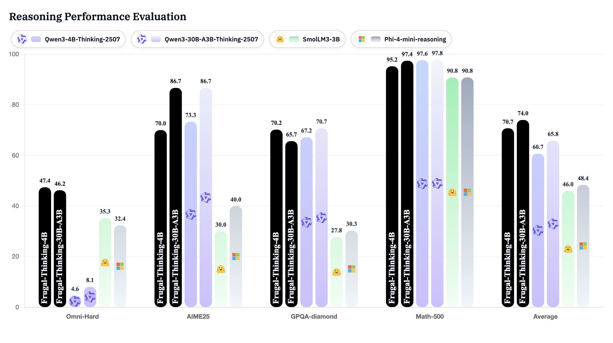
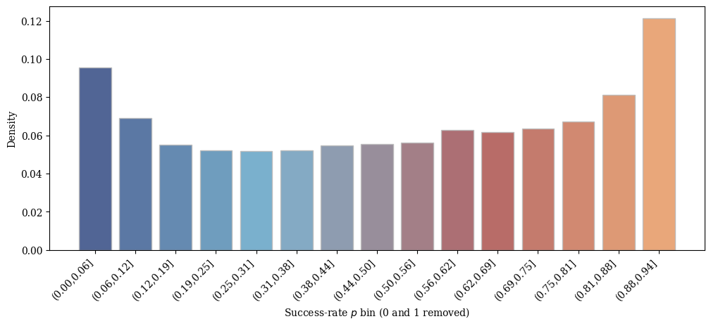

# Frugal-Math-4B

**Paper**: [Shorter but not Worse: Frugal Reasoning via Easy Samples as Length Regularizers in Math RLVR](paper.pdf)

**Trained models and datasets** are publicly available on our [Hugging Face collection](https://huggingface.co/collections/MBZUAI-Paris/frugal-ai).

**Base Model**: [Qwen/Qwen3-4B-Thinking-2507](https://huggingface.co/Qwen/Qwen3-4B-Thinking-2507)

**Authors**: [Abdelaziz Bounhar](https://scholar.google.com/citations?user=MeyZL18AAAAJ&hl=fr) et al.

**License**: Apache 2.0

<p align="center">
  
</p>
<p align="center"><em>Pass@1 performance on reasoning benchmarks.</em></p>

# Overview

Frugal-Math-4B is a reasoning-optimized variant of Qwen3-4B-Thinking-2507 trained via **Reinforcement Learning with Verifiable Rewards (RLVR)** on the [FrugalMath dataset](https://huggingface.co/datasets/MBZUAI-Paris/frugal-maths-data-split-v1).

It introduces **emergent brevity**: t**he model learns to reason efficiently and generate concise, verifiable mathematical solutions—without any explicit length penalty**.
By retaining moderately easy problems during training, Frugal-Math implicitly regularizes reasoning length,
reducing verbosity while preserving accuracy.


# Training Setup


| Parameter | Value |
|:-----------|:------|
| **Algorithm** | Group Relative Policy Optimization (GRPO) |
| **Reward function** | Verifiable binary reward (exact match of boxed answer) |
| **Context length** | 16k tokens |
| **Batch size** | 128 |
| **Group size (G)** | 16 |
| **Learning rate** | 1e-6 |
| **Compute** | 250 H200 GPU-days |
| **Framework** | [verl](https://github.com/volcengine/verl) |

## Training & Evaluation Code
- [x] Training scripts built on [verl](https://github.com/volcengine/verl) will be released soon.
- [ ] Evaluation uses [lighteval](https://github.com/huggingface/lighteval); release instructions will follow alongside the training code.

## Training Stages

| Stage | Objective | Source | #Samples | Description |
|:------|:---------|:--------|:----------|:-------------|
| **Stage 1 – Emergent Brevity** | Implicit length regularization | Internal curated mix of math datasets | 14.2 k | Moderately easy verifiable math problems encourage concise reasoning. |
| **Stage 2 – Curriculum RLVR** | Progressive learning on harder problems | Filtered subset of [DeepMath-103k](https://huggingface.co/datasets/ChuGyouk/DeepMath-Filtered-59.9K) | 14.5 k | Gradually harder math problems to improve reasoning depth and coverage. |

Both stages use verifiable math problems formatted with boxed final answers (\boxed{}), enabling deterministic reward computation via exact-match verification.

## Reproducibility
- **Stage 1** run script: `src/train/verl_0.4/slurm_xp/informal_maths/stage_1/q3_4b_it_math_xp.slurm`
- **Stage 2** run script: `src/train/verl_0.4/slurm_xp/informal_maths/stage_2/q3_4b_it_math_xp.slurm`
- Each script activates the `verl_42` Conda environment (prepare it via `src/train/verl_0.4/installation_guide.md`), configures multi-node NCCL/Ray, and resumes from the latest checkpoint automatically.
- Update the `WEKA_HOME`, `SHAREFS_HOME`, and `WANDB_API_KEY` exports before submitting to your SLURM cluster.
- Submit with `sbatch q3_4b_it_math_xp.slurm` from the respective stage directory once storage anchors are reachable.

## 📈 Success-Rate Distribution

<p align="center">
  
</p>

Empirical success-rate distribution of the base model (16 rollouts per prompt) on the training data after filtering out trivial (*success_rate = 1*) and unsolved (*success_rate = 0*) problems.

The dataset is **ready to use with [verl](https://github.com/volcengine/verl)**.


## Notes
- In this repository, easy problems (**success_rate = 1**) are kept and can be reused for SFT bootstrapping. Unsolved ones (**success_rate = 0**) are retained for long-context exploration.
- The dataset focuses exclusively on mathematical reasoning; extension to coding or logic tasks is part of ongoing research.
  
# Performance Across Benchmarks

**Evaluation metrics**: Pass@1 (%) and Efficiency-Adjusted Accuracy

**Max generation length**: 42k tokens

## Definition: Efficiency-Adjusted Accuracy (EAA)

To compare models jointly on accuracy and brevity, we introduce a new metric named **Efficiency-Adjusted Accuracy** (EAA).
EAA penalizes unnecessarily long reasoning chains:

$\text{EAA}\gamma = a \times \exp\!\left[-\gamma \cdot \frac{L - L{\min}}{L_{\max} - L_{\min}}\right]$

where a is accuracy, $L$ is average output length, and $γ$ controls how strongly long outputs are penalized ($γ$ = 3 in our experiments).
Higher EAA means the model solves tasks efficiently, with fewer tokens for similar accuracy.

## Results

| Model | Size | GPQA Diamond | AIME25 | Omni-Hard | GSM Plus | IFEval | MATH-500 | **Average** |
|:------|:----:|:-------------:|:------:|:----------:|:---------:|:-------:|:----------:|:------------:|
| [Qwen3-30B-A3B-Thinking-2507](https://huggingface.co/Qwen/Qwen3-30B-A3B-Thinking-2507) | 30B | **70.71** \| 25.26 | **86.67** \| 09.79 | 08.09 \| 00.63 | **90.29 \| 90.29** | 41.35 \| 41.35 | 97.80 \| 08.15 | 65.82 \| 29.25 |
| [SmolLM3-3B](https://huggingface.co/HuggingFaceTB/SmolLM3-3B) | 3B | 27.78 \| 01.38 | 30.00 \| 11.44 | 35.26 \| 14.20 | 83.48 \| 29.39 | **71.21** \| 03.55 | 90.80 \| 45.35 | 56.42 \| 17.55 |
| [Phi-4-mini-reasoning](https://huggingface.co/microsoft/Phi-4-mini-reasoning) | 4B | 30.30 \| 03.05 | 40.00 \| 12.83 | 32.37 \| 18.39 | 87.10 \| 61.12 | 51.58 \| 22.05 | 90.80 \| 44.21 | 55.36 \| 26.94 |
| [Qwen3-4B-Thinking-2507](https://huggingface.co/Qwen/Qwen3-4B-Thinking-2507) | 4B | 67.17 \| 03.68 | 73.33 \| 03.65 | 04.62 \| 00.23 | 89.05 \| 16.71 | 38.57 \| 20.79 | **97.60 \| 04.86** | 61.72 \| 08.32 |
| [Frugal-Math-4B-Stage-1](https://huggingface.co/MBZUAI-Paris/Frugal-Math-4B) (ours) | 4B | 63.64 \| 31.22 | 60.00 \| 43.73 | 35.84 \| 31.54 | 89.24 \| 04.44 | 39.91 \| 22.43 | 95.00 \| 55.51 | 63.94 \| 31.48 |
| **[Frugal-Math-4B-Stage-2](https://huggingface.co/MBZUAI-Paris/Frugal-Math-4B) (ours)** | 4B | 70.20 \| **70.20** | 70.00 \| **70.00** | **47.40 \| 47.40** | 89.00 \| 11.15 | 39.49 \| **23.20** | 95.20 \| **95.20** | **68.55 \| 52.86** |


## Average Reasoning Length

| Model | Size | Avg Output Length (tokens) |
|:------|:----:|:--------------------------:|
| **Qwen3-30B-A3B-Thinking-2507** | 30B | 9 946 |
| **SmolLM3-3B** | 3B | 8 338 |
| **Phi-4-mini-reasoning** | 4B | 7 458 |
| **Qwen3-4B-Thinking-2507** | 4B | 11 491 |
| **Frugal-Math-4B-Stage-1 (ours)** | 4B | **6 270** |
| **Frugal-Math-4B-Stage-2 (ours)** | 4B | **5 712** |

## Conclusions

➡️ Frugal-Math-4B-Stage 2 outperforms all 4B-class baselines in both accuracy and efficiency, achieving similar performance to the 30B MoE model, and better on average.

➡️ ≈ 50–60 % reduction in reasoning length while preserving or improving performance.

# Intended Use
- Verifiable mathematical reasoning and competition-style tasks
- Efficiency–accuracy trade-off studies in RLHF/RLVR

# 🚫 Limitations
- Optimized for math reasoning only.
- Generalization to other domains is part of ongoing research.


# Citation

If you use this model, please cite:
```bibtex
@misc{bounhar2025frugalmath,
  title={Shorter but not Worse: Frugal Reasoning via Easy Samples as Length Regularizers in Math RLVR},
  author={Bounhar, Abdelaziz et al.},
  year={2025},
  journal={arXiv preprint arXiv:2506.xxxxx}
}
```
