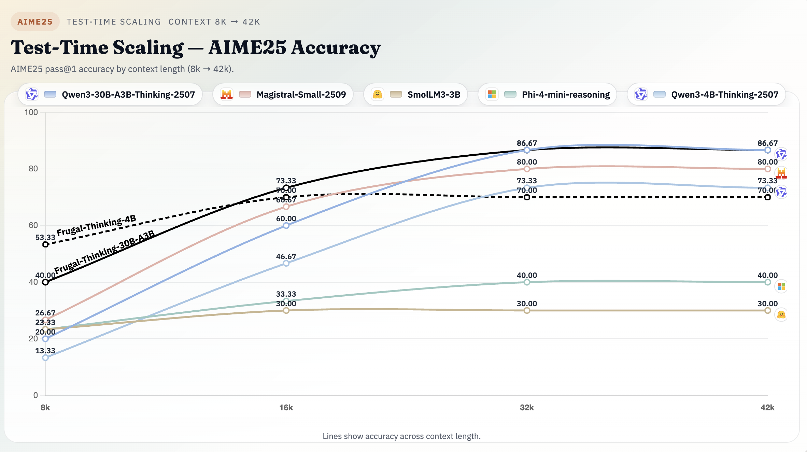

# Frugal-Thinking: Easy Samples as Length Regularizers in Math RLVR

**Paper**: [Shorter but not Worse: Frugal Reasoning via Easy Samples as Length Regularizers in Math RLVR](https://arxiv.org/pdf/2511.01937)

**Trained models and datasets** are publicly available on our [Hugging Face collection](https://huggingface.co/collections/MBZUAI-Paris/frugal-thinking).


<p align="center">
  
</p>
<p align="center"><em>Pass@1 performance on reasoning benchmarks.</em></p>

<p align="center">
  
</p>
<p align="center"><em>Test-time scaling performance on AIME25.</em></p>

# Overview

Frugal-Thinking is a reasoning-optimized variant of [Qwen3-30B-A3B-Thinking-2507](https://huggingface.co/Qwen/Qwen3-30B-A3B-Thinking-2507) and [Qwen3-4B-Thinking-2507](https://huggingface.co/Qwen/Qwen3-4B-Thinking-2507) trained via **Reinforcement Learning with Verifiable Rewards (RLVR)** on the [Frugal-Thinking dataset](https://huggingface.co/datasets/MBZUAI-Paris/Frugal-Thinking-RL-Data).

It introduces **emergent brevity**: **the model learns to reason efficiently and generate concise, verifiable mathematical solutions without any explicit length penalty!**.
By retaining moderately easy problems during training, Frugal-Thinking implicitly regularizes reasoning length, reducing verbosity while preserving accuracy.


# Training Setup

| Parameter | Value |
|:-----------|:------|
| **Algorithm** | Group Relative Policy Optimization (GRPO) |
| **Reward function** | Verifiable binary reward (exact match of boxed answer) |
| **Context length** | 16k tokens |
| **Batch size** | 128 |
| **Group size (G)** | 16 |
| **Learning rate** | 1e-6 |
| **Compute** | 250 H200 GPU-days |
| **Framework** | [verl](https://github.com/volcengine/verl) |

*Note*: We did a run with Group Sequence Policy Optimization (GSPO) for the MoE version, but we did not observe performance gains. GRPO performed better.

## Training & Evaluation Code
- [x] Training scripts built on [verl](https://github.com/volcengine/verl) will be released soon.
- [x] Evaluation uses [lighteval](https://github.com/huggingface/lighteval); release instructions will follow alongside the training code.

## Training Stages

| Stage | Objective | Source | #Samples | Description |
|:------|:---------|:--------|:----------|:-------------|
| **Stage 1 – Emergent Brevity** | Implicit length regularization | Internal curated mix of math datasets | 14.2 k | Moderately easy verifiable math problems encourage concise reasoning. |
| **Stage 2 – Curriculum RLVR** | Progressive learning on harder problems | Filtered subset of [DeepMath-103k](https://huggingface.co/datasets/ChuGyouk/DeepMath-Filtered-59.9K) | 14.5 k | Gradually harder math problems to improve reasoning depth and coverage. |

Both stages use verifiable math problems formatted with boxed final answers (\boxed{}), enabling deterministic reward computation via exact-match verification.

## Reproducibility
With *model_size=30* for the MoE and *model_size=4* for the dense models:
- **Stage 1** run script: `src/train/verl_0.4/slurm_xp/informal_maths/stage_1/q3_{model_size}b_it_math_xp.slurm`
- **Stage 2** run script: `src/train/verl_0.4/slurm_xp/informal_maths/stage_2/q3_{model_size}b_it_math_xp.slurm`
- Each script activates the `verl_42` Conda environment (prepare it via `src/train/verl_0.4/installation_guide.md`), configures multi-node NCCL/Ray, and resumes from the latest checkpoint automatically.
- Update the `WEKA_HOME`, `SHAREFS_HOME`, and `WANDB_API_KEY` exports before submitting to your SLURM cluster.
- Submit with `sbatch q3_4b_it_math_xp.slurm` from the respective stage directory once storage anchors are reachable.

## 📈 Training Dataset: Success-Rate Distribution

<p align="center">
  
</p>

Empirical success-rate distribution of the base model (16 rollouts per prompt) on the training data after filtering out trivial (*success_rate = 1*) and unsolved (*success_rate = 0*) problems.

The dataset is **ready to use with [verl](https://github.com/volcengine/verl)**.

*Note*: The dataset focuses exclusively on mathematical reasoning; extension to coding or logic tasks is part of ongoing research.
  
# Performance Across Benchmarks

**Evaluation metrics**: Pass@1 (%) and Efficiency-Adjusted Accuracy

**Max generation length**: 42k tokens

## Definition: Efficiency-Adjusted Accuracy (EAA)

To compare models jointly on accuracy and brevity, we introduce a new metric named **Efficiency-Adjusted Accuracy** (EAA).
EAA penalizes unnecessarily long reasoning chains:

$\text{EAA}\gamma = a \times \exp\!\left[-\gamma \cdot \frac{L - L{\min}}{L_{\max} - L_{\min}}\right]$

where a is accuracy, $L$ is average output length, and $γ$ controls how strongly long outputs are penalized ($γ$ = 3 in our experiments).
Higher EAA means the model solves tasks efficiently, with fewer tokens for similar accuracy.

## Results on Reasoning Benchmarks (42k-token decoding budget)

**Format:** `pass@1 | EAA₃`  
*(IFEval reports average accuracy instead of pass@1)*

| Model | Size | GPQA Diamond | AIME25 | Omni-Hard | GSM Plus | IFEval | MATH-500 | **Average** |
|:--|:--:|:--:|:--:|:--:|:--:|:--:|:--:|:--:|
| [Qwen3-30B-A3B-Thinking-2507](https://huggingface.co/Qwen/Qwen3-30B-A3B-Thinking-2507) | 30B | **70.71 \| 43.96** | **86.67 \| 13.93** | 08.09 \| 00.63 | 90.29 \| **90.29** | 41.35 \| **41.35** | **97.80 \| 62.73** | 65.82 \| 42.15 |
| [Magistral-Small-2509](https://huggingface.co/mistralai/Magistral-Small-2509) | 24B | 62.63 \| **62.63** | 80.00 \| 20.71 | **53.18 \| 11.41** | 88.86 \| 86.42 | 39.71 \| 30.77 | 96.60 \| 81.77 | 70.16 \| 48.95 |
| [Magistral-Small-2507](https://huggingface.co/mistralai/Magistral-Small-2507) | 24B | 57.07 \| 02.84 | 53.33 \| 02.66 | 34.10 \| 03.60 | 81.29 \| 04.05 | 41.75 \| 06.76 | 93.20 \| 04.64 | 60.12 \| 04.09 |
| [SmolLM3-3B](https://huggingface.co/HuggingFaceTB/SmolLM3-3B) | 3B | 27.78 \| 11.55 | 30.00 \| 13.36 | 35.26 \| 14.20 | 83.48 \| 79.15 | **71.21 \| 03.55** | 90.80 \| 80.20 | 56.42 \| 33.67 |
| [Phi-4-mini-reasoning](https://huggingface.co/microsoft/Phi-4-mini-reasoning) | 4B | 30.30 \| 14.55 | 40.00 \| 15.41 | 32.37 \| 18.39 | 87.10 \| 85.54 | 51.58 \| 22.05 | 90.80 \| 79.84 | 55.36 \| 39.30 |
| [Qwen3-30B-A3B-Thinking-2507](https://huggingface.co/Qwen/Qwen3-30B-A3B-Thinking-2507) | 4B | 67.17 \| 28.48 | 73.33 \| 05.93 | 04.62 \| 00.23 | 89.05 \| 81.77 | 38.57 \| 20.79 | 97.60 \| 57.08 | 61.72 \| 32.38 |
| — | — | — | — | — | — | — | — | — |
| **Frugal-Thinking-30B-A3B-Stage-1 (ours)** | 30B | 70.20 \| 39.14 | 83.33 \| 15.41 | 06.94 \| 00.72 | 90.47 \| 87.79 | 41.65 \| 40.54 | 97.20 \| 73.26 | 64.97 \| 42.80 |
| **[Frugal-Thinking-30B-A3B-Stage-2](https://huggingface.co/MBZUAI-Paris/Frugal-Thinking-30B-A3B) (ours)** | 30B | 65.65 \| 33.17 | **86.67 \| 44.60** | 46.24 \| 21.62 | **90.57 \| 75.55** | 42.07 \| 36.92 | 97.40 \| 88.78 | **71.43 \| 50.11** |
| **Frugal-Thinking-4B-Stage-1 (ours)** | 4B | 63.64 \| 42.21 | 60.00 \| 46.02 | 35.84 \| 31.54 | 89.24 \| 76.59 | 39.91 \| 22.43 | 95.00 \| 86.30 | 63.94 \| 50.85 |
| **[Frugal-Thinking-4B-Stage-2](https://huggingface.co/MBZUAI-Paris/Frugal-Thinking-4B) (ours)** | 4B | **70.20 \| 53.84** | 70.00 \| **70.00** | **47.40 \| 47.40** | 89.00 \| 80.06 | 39.49 \| 23.20 | 95.20 \| **95.20** | 68.55 \| **61.22** |


## Average Reasoning Length

| Model | Size | Avg Output Length (tokens) |
|:--|:--:|:--:|
| Qwen3-30B-A3B-Thinking-2507 | 30B | 9 946 |
| Magistral-Small-2509 | 24B | 8 100 |
| Magistral-Small-2507 | 24B | 17 116 |
| SmolLM3-3B | 3B | 8 338 |
| Phi-4-mini-reasoning | 4B | 7 458 |
| Qwen3-30B-A3B-Thinking-2507 | 4B | 11 491 |
| **Frugal-Thinking-30B-A3B-Stage-1 (ours)** | 30B | 9 537 |
| **Frugal-Thinking-30B-A3B-Stage-2 (ours)** | 30B | **7 326** |
| **Frugal-Thinking-4B-Stage-1 (ours)** | 4B | 6 270 |
| **Frugal-Thinking-4B-Stage-2 (ours)** | 4B | **5 712** |


## Conclusions

Frugal-Thinking demonstrates that **reasoning efficiency can be learned implicitly**, without explicit length penalties, by carefully structuring the RLVR training distribution.

- **Frugal-Thinking-4B-Stage-2** consistently outperforms all 4B-class baselines in both **accuracy and efficiency**, and **matches or exceeds the average performance of a 30B MoE model**, despite being an order of magnitude smaller.
- Across reasoning benchmarks, Frugal-Thinking achieves a **≈50–60% reduction in average reasoning length** while **preserving or improving pass@1 accuracy**, leading to substantially higher **Efficiency-Adjusted Accuracy (EAA)**.
- The results highlight a practical path toward **compute-efficient reasoning models**, where test-time cost can be significantly reduced **without sacrificing reliability or correctness**.

Overall, Frugal-Thinking shows that **shorter reasoning is not weaker reasoning** and that careful RLVR data design can yield models that are both **accurate and frugal by construction**.

## Intended Use

This model is designed for **reasoning-intensive workloads**, with a particular focus on controllable efficiency and verifiability:

- **Verifiable mathematical reasoning** and competition-style problem solving (e.g., AIME, GSM, MATH, GPQA)
- **Reasoning** under constrained or variable test-time compute budgets
- **Efficiency–accuracy trade-off analysis** in RLHF / RLVR and test-time scaling studies
- **Reasoning length control and compression**, enabling shorter, more cost-efficient chains of thought
- **Benchmarking reasoning robustness** across context lengths and difficulty regimes
- **Research on test-time compute allocation**, adaptive reasoning, and frugal inference

⚠️ **Not intended for** (but could be used):
- Open-ended creative writing or stylistic generation
- Conversational agents requiring rich persona or emotional interaction


# Citation

If you use this model, please cite:
```bibtex
@misc{bounhar2025frugalmath,
  title={Shorter but not Worse: Frugal Reasoning via Easy Samples as Length Regularizers in Math RLVR},
  author={Bounhar, Abdelaziz et al.},
  year={2025},
  journal={arXiv preprint arXiv:2511.01937}
}
```
